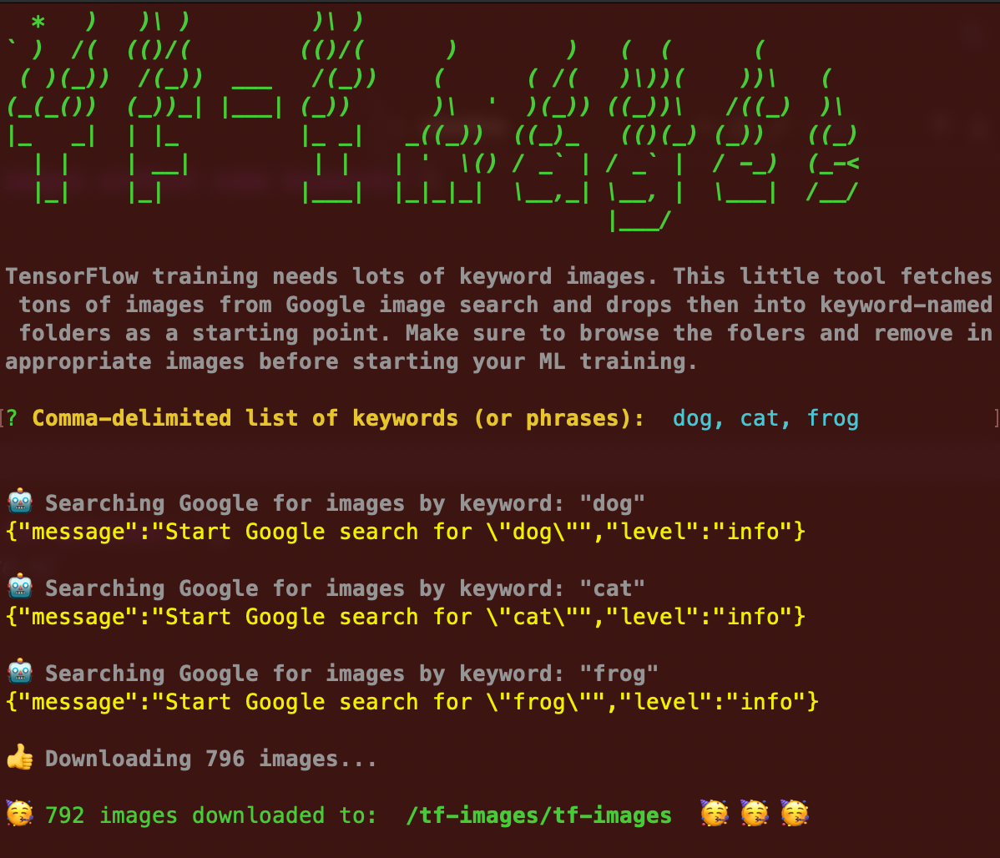

# tf-images -- TensforFlow Keyword Image Grabber

<p align="center">
  
</p>

CLI tool for quickly fetching thousands of keyword images for ML training

Gathering up training images is a pain. With this CLI command, you can gather
thousands of training images in a minute, organized into folders by keyword.

This was an afternoon project I wrote to help my 7-yr-old learn TensorFlow.js
It has not been tested on Windows. Because I already did my time. Pull requests welcome.

## To install

```.js
npm i -g tf-images
```

## To Use

After installing globally, cd to any directory and invoke like:

```.js
tf-images "dog, cat, mouse, rat"
```

A `tf-images` directory will be created with sub-directories `dog`, `cat` etc.
Each sub-directory will contain hundreds of keyword images.


